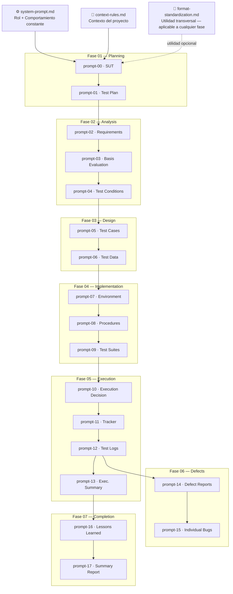

# 🤖 08 — GenAI Test Acceleration

---

## ¿Qué contiene este módulo?

Este módulo documenta cómo se usó la IA a lo largo de todo el ciclo —
fase por fase. No es un extra al final del proyecto: cada prompt
corresponde a un artefacto real que existe en este repositorio.

El CT-GenAI v1.1 de ISTQB establece que la IA puede apoyar tareas de
análisis, diseño, implementación y ejecución de pruebas — siempre que
el tester aplique evaluación humana sistemática sobre cada output antes
de avanzar. Eso es lo que documenta este módulo: el proceso, no solo
el resultado.

> [!NOTE]
> Cada prompt está dividido en dos bloques: la descripción del artefacto
> que produce y el prompt ejecutable con sus componentes. El Rol y el
> Contexto viven en `00-core-config/` — los prompts heredan esa base y
> solo definen lo que cambia por tarea. Esto refleja la distinción
> **system prompt / user prompt** del CT-GenAI v1.1 sección 2.1.3.

---

> [!IMPORTANT]
> Cada flecha sólida es una dependencia de datos real: el output aprobado
> del prompt anterior es el input data del siguiente. Eso es el
> prompt chaining aplicado al STLC completo — sección 2.1.2
> del CT-GenAI v1.1.
>
> La flecha punteada de `format-standardization.md` indica que es una
> utilidad transversal: puede aplicarse sobre cualquier artefacto del
> ciclo, en cualquier fase, sin romper la cadena principal.

---

## Highlights

- **System prompt separado del user prompt** — el comportamiento del modelo se define una vez en `00-core-config/` y no se repite en ningún prompt. Sección 2.1.3 del CT-GenAI v1.1 en práctica.
- **Prompt chaining como columna vertebral** — la cadena `REQ → AC → TCND → TC → TX → BUG` no es solo trazabilidad de artefactos: es la secuencia de prompts que se ejecutó fase a fase.
- **HITL en cada entrega** — ningún prompt genera un artefacto final en el primer intento. El proceso es siempre borrador → validación del tester → entrega final. Verificación humana sistemática según CT-GenAI v1.1 cap. 3.

---

📋 Ver qué se aplicó de la guía CT-GenAI v1.1

| Práctica CT-GenAI | Sección v1.1 | Cómo se aplicó |
| :--- | :--- | :--- |
| Estructura de 6 componentes | GenAI-2.1.1 | Cada prompt tiene: Instrucción · Input data · Constraints · Output format. Rol y Contexto en `system-prompt.md` |
| System prompt vs. User prompt | GenAI-2.1.3 | `system-prompt.md` define el comportamiento constante. Cada `prompt-XX.md` es el user prompt de su fase |
| Prompt chaining | GenAI-2.1.2 | Output de cada fase = input de la siguiente. Implementado como dependencia explícita entre prompts |
| HITL — verificación humana | GenAI-2.2.1b | Cada prompt incluye validación con el tester antes de avanzar. Sin aprobación no se genera el artefacto final |
| Análisis con GenAI | GenAI-2.2.1 | Prompts 02, 03 y 04 apoyan REQ, AC y TCND con verificación manual en cada intercambio |
| Diseño con GenAI | GenAI-2.2.2 | Prompts 05 y 06 derivan TC desde TCND y TD desde TC mediante prompt chaining |
| Evaluación y refinamiento de prompts | GenAI-2.3.2 | `prompt-17` y `format-standardization.md` aplican técnicas de refinamiento iterativo sobre los artefactos del ciclo |
| Evaluación sistemática del output | CT-GenAI v1.1 cap. 3 | El modelo propone. El tester analiza, audita y decide — ningún artefacto se aprueba sin validación humana |

---

📁 Ver todos los prompts por fase

### `00-core-config/` — Configuración base

| Archivo | Descripción | Estado |
| :--- | :--- | :--- |
| [`system-prompt.md`](./00-core-config/system-prompt.md) | Rol, nivel de operación, estilo de redacción y restricciones del modelo | ✅ Activo |
| [`context-rules.md`](./00-core-config/context-rules.md) | Contexto del proyecto: SUT, trazabilidad y convenciones | ✅ Activo |
| [`format-standardization.md`](./00-core-config/format-standardization.md) | Utilidad transversal de estandarización de formato Markdown — aplicable a cualquier artefacto del ciclo | ✅ Activo |

### `01-planning-prompts/`

| Archivo | Artefacto que genera | Estado |
| :--- | :--- | :--- |
| [`prompt-00-sut.md`](./01-planning-prompts/prompt-00-sut.md) | `system-under-test.md` | ✅ Documentado |
| [`prompt-01-test-plan.md`](./01-planning-prompts/prompt-01-test-plan.md) | `test-plan.md` | ✅ Documentado |

### `02-analysis-prompts/`

| Archivo | Artefacto que genera | Estado |
| :--- | :--- | :--- |
| [`prompt-02-requirements.md`](./02-analysis-prompts/prompt-02-requirements.md) | `requirements.md` | ✅ Documentado |
| [`prompt-03-basis-evaluation.md`](./02-analysis-prompts/prompt-03-basis-evaluation.md) | `test-basis-evaluation.md` | ✅ Documentado |
| [`prompt-04-test-conditions.md`](./02-analysis-prompts/prompt-04-test-conditions.md) | `test-conditions.md` | ✅ Documentado |

### `03-design-prompts/`

| Archivo | Artefacto que genera | Estado |
| :--- | :--- | :--- |
| [`prompt-05-test-cases.md`](./03-design-prompts/prompt-05-test-cases.md) | `test-cases.md` | ✅ Documentado |
| [`prompt-06-test-data.md`](./03-design-prompts/prompt-06-test-data.md) | `test-data-requirements.md` | ✅ Documentado |

### `04-implementation-prompts/`

| Archivo | Artefacto que genera | Estado |
| :--- | :--- | :--- |
| [`prompt-07-environment.md`](./04-implementation-prompts/prompt-07-environment.md) | `test-environment-setup.md` | ✅ Documentado |
| [`prompt-08-procedures.md`](./04-implementation-prompts/prompt-08-procedures.md) | `test-procedures.md` | ✅ Documentado |
| [`prompt-09-test-suites.md`](./04-implementation-prompts/prompt-09-test-suites.md) | `test-suites.md` | ✅ Documentado |

### `05-execution-prompts/`

| Archivo | Artefacto que genera | Estado |
| :--- | :--- | :--- |
| [`prompt-10-execution-decision.md`](./05-execution-prompts/prompt-10-execution-decision.md) | `edn-01-execution-decision-note.md` | ✅ Documentado |
| [`prompt-11-execution-tracker.md`](./05-execution-prompts/prompt-11-execution-tracker.md) | `test-execution-tracker.md` | ✅ Documentado |
| [`prompt-12-test-logs.md`](./05-execution-prompts/prompt-12-test-logs.md) | `tl-01` · `tl-02` · `tl-03` | ✅ Documentado |
| [`prompt-13-execution-summary.md`](./05-execution-prompts/prompt-13-execution-summary.md) | `test-execution-summary.md` | ✅ Documentado |

### `06-defect-prompts/`

| Archivo | Artefacto que genera | Estado |
| :--- | :--- | :--- |
| [`prompt-14-defect-reports.md`](./06-defect-prompts/prompt-14-defect-reports.md) | `defect-reports.md` | ✅ Documentado |
| [`prompt-15-individual-bugs.md`](./06-defect-prompts/prompt-15-individual-bugs.md) | `bug-01` · `bug-02` · `bug-03` | ✅ Documentado |

### `07-completion-prompts/`

| Archivo | Artefacto que genera | Estado |
| :--- | :--- | :--- |
| [`prompt-16-lessons-learned.md`](./07-completion-prompts/prompt-16-lessons-learned.md) | `lessons-learned.md` | ✅ Documentado |
| [`prompt-17-summary-report.md`](./07-completion-prompts/prompt-17-summary-report.md) | `test-summary-report.md` | ✅ Documentado |

---

🔁 ¿Cómo reproducir este proyecto con IA?

> [!TIP]
> Podés usar cualquier LLM con soporte de system prompt o proyectos:
> Claude Projects, ChatGPT Projects, Gemini Gems, o cualquier plataforma
> que permita configurar instrucciones persistentes y adjuntar documentos
> de conocimiento.

**1. Construí la base de conocimiento del modelo una sola vez**

Para que la IA trabaje bajo un marco conceptual sólido y produzca
artefactos alineados a estándares reales, la configuración inicial
tiene tres capas:

- Cargá `system-prompt.md` como system prompt o instrucción
  personalizada — define el rol, el nivel de operación y las
  restricciones del modelo durante todo el ciclo.
- Cargá `context-rules.md` como contexto del proyecto — define el
  SUT, las convenciones de trazabilidad y los IDs de artefactos.
- **Adjuntá el syllabus ISTQB CTFL v4.0 (o la versión más actual
  disponible) como documento de conocimiento del proyecto.** Esto
  ancla al modelo a definiciones, técnicas y terminología ISTQB
  precisas — reduce alucinaciones terminológicas y eleva la calidad
  de los artefactos generados sin necesidad de repetir definiciones
  en cada prompt.

> [!NOTE]
> Si la plataforma que usás soporta múltiples documentos de
> conocimiento (como Claude Projects, ChatGPT Projects o Gemini Gems),
> podés adjuntar también el syllabus CT-GenAI v1.1 para que el modelo
> aplique las prácticas de uso responsable de IA durante todo el ciclo.

> [!TIP]
> Este proyecto está configurado para mi nivel junior y mi tono y
> estilo de redacción. Si querés resultados diferentes, modificá el
> `system-prompt.md` a tu nivel y estilo antes de arrancar.
>
> Si solo querés cubrir las fases que normalmente le corresponden a un
> junior en proceso — ejecución y reporte de bugs — no necesitás el
> ciclo completo. Modificá el `context-rules.md`, dejá solo las fases
> que vas a ejecutar y usá únicamente los artefactos que necesitás.
>
> Al principio todo es difícil, pero nada es imposible. Yo lo logré — ánimo. 💪

**2. Una conversación por fase**

Abrí una conversación nueva por cada carpeta de prompts. Dentro de
esa conversación ejecutá los prompts en orden — el modelo acumula
el contexto de los artefactos anteriores de la misma fase. Eso es
el prompt chaining en práctica.

**3. Validá antes de pasar a la siguiente fase**

El output aprobado de una conversación se convierte en el input data
de la siguiente. No copies output sin revisar — el tester analiza,
audita y decide.

> [!IMPORTANT]
> Una conversación por fase — no mezcles módulos en el mismo hilo.
> Cuanto más limpio el contexto, más determinista el output
> y más fácil detectar alucinaciones.

---

## Navegación

← [07 — Test Completion](../07-test-completion/lessons-learned.md) &nbsp;|&nbsp; [README principal](../README.md) →
