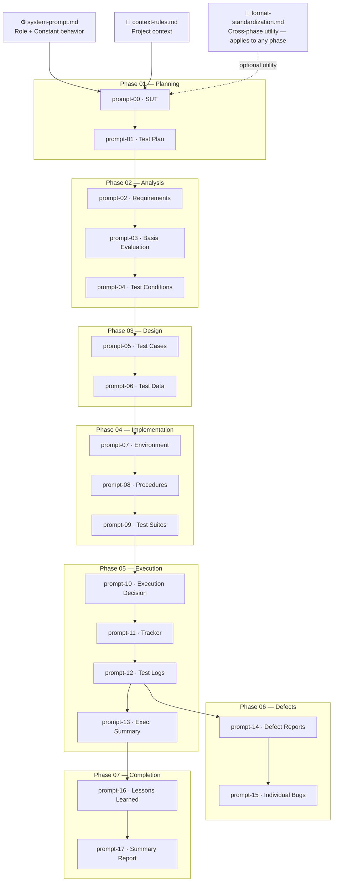

# 🤖 08 — GenAI Test Acceleration

---

## What does this module contain?

This module documents how AI was used throughout the entire cycle —
phase by phase. It is not an add-on at the end of the project: every
prompt corresponds to a real artifact that exists in this repository.

ISTQB CT-GenAI v1.1 states that AI can support testing tasks such as
analysis, design, implementation and execution — as long as the tester
applies systematic human evaluation to every output before moving
forward. That is what this module documents: the process, not just
the result.

> [!NOTE]
> Each prompt is divided into two blocks: a description of the artifact
> it produces and the executable prompt with its components. The Role
> and Context live in `00-core-config/` — the prompts inherit that base
> and only define what changes per task. This reflects the
> **system prompt / user prompt** distinction from CT-GenAI v1.1
> section 2.1.3.

---

> [!IMPORTANT]
> Each solid arrow is a real data dependency: the approved output of the
> previous prompt is the input data for the next one. This is prompt
> chaining applied to the full STLC — CT-GenAI v1.1 section 2.1.2.
>
> The dotted arrow from `format-standardization.md` indicates that it
> is a cross-phase utility: it can be applied to any artifact in any
> phase without breaking the main chain.

---

## Highlights

- **System prompt separated from user prompt** — the model behavior is defined once in `00-core-config/` and is never repeated in any prompt. CT-GenAI v1.1 section 2.1.3 in practice.
- **Prompt chaining as the backbone** — the chain `REQ → AC → TCND → TC → TX → BUG` is not just artifact traceability: it is the sequence of prompts executed phase by phase.
- **HITL on every delivery** — no prompt generates a final artifact on the first attempt. The process is always draft → tester validation → final delivery. Systematic human verification per CT-GenAI v1.1 chapter 3.

---

📋 What was applied from the CT-GenAI v1.1 guide

| CT-GenAI Practice | v1.1 Section | How it was applied |
| :--- | :--- | :--- |
| 6-component structure | GenAI-2.1.1 | Each prompt has: Instruction · Input data · Constraints · Output format. Role and Context in `system-prompt.md` |
| System prompt vs. User prompt | GenAI-2.1.3 | `system-prompt.md` defines the constant behavior. Each `prompt-XX.md` is the user prompt for its phase |
| Prompt chaining | GenAI-2.1.2 | Output of each phase = input of the next. Implemented as an explicit dependency between prompts |
| HITL — human verification | GenAI-2.2.1b | Each prompt includes tester validation before advancing. No artifact is finalized without approval |
| Analysis with GenAI | GenAI-2.2.1 | Prompts 02, 03 and 04 support REQ, AC and TCND with manual verification at each exchange |
| Design with GenAI | GenAI-2.2.2 | Prompts 05 and 06 derive TC from TCND and TD from TC through prompt chaining |
| Prompt evaluation and refinement | GenAI-2.3.2 | `prompt-17` and `format-standardization.md` apply iterative refinement techniques to cycle artifacts |
| Systematic output evaluation | CT-GenAI v1.1 ch. 3 | The model proposes. The tester analyzes, audits and decides — no artifact is approved without human validation |

---

📁 All prompts by phase

### `00-core-config/` — Base configuration

| File | Description | Status |
| :--- | :--- | :--- |
| [`system-prompt.md`](./00-core-config/system-prompt.md) | Role, operation level, writing style and model restrictions | ✅ Active |
| [`context-rules.md`](./00-core-config/context-rules.md) | Project context: SUT, traceability and conventions | ✅ Active |
| [`format-standardization.md`](./00-core-config/format-standardization.md) | Cross-phase Markdown format standardization utility — applies to any artifact in the cycle | ✅ Active |

### `01-planning-prompts/`

| File | Artifact generated | Status |
| :--- | :--- | :--- |
| [`prompt-00-sut.md`](./01-planning-prompts/prompt-00-sut.md) | `system-under-test.md` | ✅ Documented |
| [`prompt-01-test-plan.md`](./01-planning-prompts/prompt-01-test-plan.md) | `test-plan.md` | ✅ Documented |

### `02-analysis-prompts/`

| File | Artifact generated | Status |
| :--- | :--- | :--- |
| [`prompt-02-requirements.md`](./02-analysis-prompts/prompt-02-requirements.md) | `requirements.md` | ✅ Documented |
| [`prompt-03-basis-evaluation.md`](./02-analysis-prompts/prompt-03-basis-evaluation.md) | `test-basis-evaluation.md` | ✅ Documented |
| [`prompt-04-test-conditions.md`](./02-analysis-prompts/prompt-04-test-conditions.md) | `test-conditions.md` | ✅ Documented |

### `03-design-prompts/`

| File | Artifact generated | Status |
| :--- | :--- | :--- |
| [`prompt-05-test-cases.md`](./03-design-prompts/prompt-05-test-cases.md) | `test-cases.md` | ✅ Documented |
| [`prompt-06-test-data.md`](./03-design-prompts/prompt-06-test-data.md) | `test-data-requirements.md` | ✅ Documented |

### `04-implementation-prompts/`

| File | Artifact generated | Status |
| :--- | :--- | :--- |
| [`prompt-07-environment.md`](./04-implementation-prompts/prompt-07-environment.md) | `test-environment-setup.md` | ✅ Documented |
| [`prompt-08-procedures.md`](./04-implementation-prompts/prompt-08-procedures.md) | `test-procedures.md` | ✅ Documented |
| [`prompt-09-test-suites.md`](./04-implementation-prompts/prompt-09-test-suites.md) | `test-suites.md` | ✅ Documented |

### `05-execution-prompts/`

| File | Artifact generated | Status |
| :--- | :--- | :--- |
| [`prompt-10-execution-decision.md`](./05-execution-prompts/prompt-10-execution-decision.md) | `edn-01-execution-decision-note.md` | ✅ Documented |
| [`prompt-11-execution-tracker.md`](./05-execution-prompts/prompt-11-execution-tracker.md) | `test-execution-tracker.md` | ✅ Documented |
| [`prompt-12-test-logs.md`](./05-execution-prompts/prompt-12-test-logs.md) | `tl-01` · `tl-02` · `tl-03` | ✅ Documented |
| [`prompt-13-execution-summary.md`](./05-execution-prompts/prompt-13-execution-summary.md) | `test-execution-summary.md` | ✅ Documented |

### `06-defect-prompts/`

| File | Artifact generated | Status |
| :--- | :--- | :--- |
| [`prompt-14-defect-reports.md`](./06-defect-prompts/prompt-14-defect-reports.md) | `defect-reports.md` | ✅ Documented |
| [`prompt-15-individual-bugs.md`](./06-defect-prompts/prompt-15-individual-bugs.md) | `bug-01` · `bug-02` · `bug-03` | ✅ Documented |

### `07-completion-prompts/`

| File | Artifact generated | Status |
| :--- | :--- | :--- |
| [`prompt-16-lessons-learned.md`](./07-completion-prompts/prompt-16-lessons-learned.md) | `lessons-learned.md` | ✅ Documented |
| [`prompt-17-summary-report.md`](./07-completion-prompts/prompt-17-summary-report.md) | `test-summary-report.md` | ✅ Documented |

---

🔁 How to reproduce this project with AI

> [!TIP]
> You can use any LLM with system prompt or project support:
> Claude Projects, ChatGPT Projects, Gemini Gems, or any platform
> that allows persistent instructions and knowledge document attachments.

**1. Build the model knowledge base once**

For the AI to work within a solid conceptual framework and produce
artifacts aligned to real standards, the initial setup has three layers:

- Load `system-prompt.md` as the system prompt or custom instruction
  — it defines the role, operation level and model restrictions for
  the entire cycle.
- Load `context-rules.md` as the project context — it defines the
  SUT, traceability conventions and artifact IDs.
- **Attach the ISTQB CTFL v4.0 syllabus (or the most current version
  available) as a project knowledge document.** This anchors the model
  to precise ISTQB definitions, techniques and terminology — it reduces
  terminology hallucinations and raises artifact quality without
  repeating definitions in every prompt.

> [!NOTE]
> If the platform you use supports multiple knowledge documents
> (such as Claude Projects, ChatGPT Projects or Gemini Gems),
> you can also attach the CT-GenAI v1.1 syllabus so the model applies
> responsible AI practices throughout the entire cycle.

> [!TIP]
> This project is configured for my junior level and my writing tone
> and style. If you want different results, modify `system-prompt.md`
> to match your level and style before starting.
>
> If you only want to cover the phases that typically belong to a
> junior in progress — execution and bug reporting — you do not need
> the full cycle. Modify `context-rules.md`, keep only the phases you
> plan to execute and use only the artifacts you need.
>
> Everything is hard at the beginning, but nothing is impossible.
> I made it — you can too. 💪

**2. One conversation per phase**

Open a new conversation for each prompt folder. Inside that
conversation run the prompts in order — the model accumulates context
from the previous artifacts in the same phase. That is prompt chaining
in practice.

**3. Validate before moving to the next phase**

The approved output of one conversation becomes the input data for the
next. Do not copy output without reviewing — the tester analyzes,
audits and decides.

> [!IMPORTANT]
> One conversation per phase — do not mix modules in the same thread.
> The cleaner the context, the more deterministic the output and the
> easier it is to detect hallucinations.

---

## Navigation

← [07 — Test Completion](../07-test-completion/lessons-learned.md) &nbsp;|&nbsp; [Main README](../README.md) →
