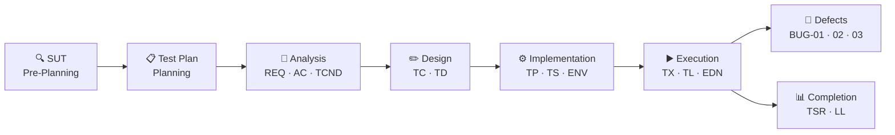
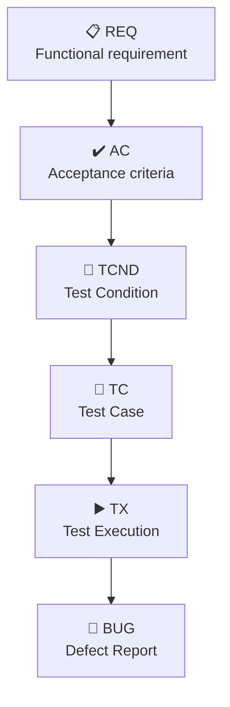

# 🧪 ISTQB Manual QA — E-commerce Functional Testing

**Luis Malave · QA Tester in Progress**

&nbsp;

---

> 🌐 **Language:** You are reading the English version.
> [🇪🇸 Versión en Español disponible aquí](../../tree/es/main)

---

## What is this?

I applied the full Software Testing Life Cycle (STLC) on a demo e-commerce system — the kind of environment available to junior testers for hands-on practice without requiring corporate access. All work products are documented in Markdown for traceability, navigation, and reproducibility. Defects are also reported in Jira as a way to practice defect tracking workflow.

AI supported me in two ways: I used reverse engineering to build requirement context, and applied a prompt per phase to structure each artifact. I also used AI as a research tool to explore ISTQB guidelines as I was building. In every case, I followed CT-GenAI v1.1: the model proposes, the tester analyses, audits, and decides — systematic human review of the output is a condition for valid AI usage.

> [!NOTE]
> This repository covers phases that go beyond what is usually expected
> from a junior QA in daily tasks. This was a deliberate decision,
> not a mistake. When you know how to draft a Test Plan or formally close
> a cycle with a Summary Report, the tasks you will actually be assigned
> start to make more sense.

> [!TIP]
> If you are building your first QA portfolio, this repository can be
> used as a lab. The folder [`08-genai-test-acceleration`](./08-genai-test-acceleration/README.md)
> contains all 19 prompts used to build each artifact —
> documented and ready to use in your own project.

---

## What was tested, and how?

| Attribute | Detail |
| :--- | :--- |
| **SUT** | Tricentis Demo Web Shop — E-commerce B2C |
| **Level** | System Testing |
| **Type** | Functional Testing — Black Box |
| **Strategy** | Risk-Based Testing |
| **Techniques** | EP · BVA · State Transition · Error Guessing |
| **Environment** | Windows 10 Pro / Firefox 150.0.1 |
| **Modules** | Search · Catalog · Product · Cart · Registration · Login · Checkout |

> [!NOTE]
> This repository contains only manual functional testing.
> API testing, automation, and SQL are not included here as I am
> learning those in parallel — each will have its own repository when
> I am ready to document them at the same standard.
> Links will appear on my GitHub profile.

---

## Cycle Flow

## Cycle Metrics

| Indicator | Result |
| :--- | :--- |
| ✅ Test Executions (`TX`) | 12 / 12 completed |
| ✅ Pass Rate E2E (`TS-03`) | 100% |
| ✅ Critical / High Defects at close | 0 |
| ✅ Requirements Coverage | 7 / 7 `REQ` with at least 1 `TX` PASS |
| 🔴 Open defects | 3 (**`BUG-01`** Medium · **`BUG-02`** Low · **`BUG-03`** Medium) |
| 📄 Artifacts produced | 19 Markdown documents |
| 📅 Project period | Feb 2026 — May 2026 |
| 🤖 AI-Gen prompts documented | 19 reproducible prompts |

---

## The AI-Gen Module

> [!IMPORTANT]
> The `08-genai-test-acceleration` folder is not extra. It documents  
> how AI was applied at every phase of the cycle, aligned to the  
> **CT-GenAI v1.1** ISTQB standard. Each prompt contains artifact  
> description, instruction, input data, constraints, and output format —  
> ready to execute in any new project.

---

## Project Navigation

| # | Module | Content | Status |
| :--- | :--- | :--- | :--- |
| `00` | [Context & Overview](./00-context-and-overview/) | SUT — System Under Test | ✅ Approved |
| `01` | [Test Planning](./01-test-planning/) | Test Plan · Scope · Risks · Criteria | ✅ Approved |
| `02` | [Test Analysis](./02-test-analysis/) | REQ · AC · Anomalies · Test Conditions | ✅ Approved |
| `03` | [Test Design](./03-test-design/) | Test Cases · Test Data | ✅ Approved |
| `04` | [Test Implementation](./04-test-implementation/) | Procedures · Suites · Environment | ✅ Approved |
| `05` | [Test Execution](./05-test-execution/) | TX · Logs · EDN · Execution Summary | ✅ Completed |
| `06` | [Defect Management](./06-defect-management/) | **`BUG-01`** · **`BUG-02`** · **`BUG-03`** · [Jira Evidence](./05-test-execution/test-evidence/jira-evidence/) | 🔴 Open |
| `07` | [Test Completion](./07-test-completion/) | Test Summary Report · Lessons Learned | ✅ Completed |
| `08` | [GenAI Test Acceleration](./08-genai-test-acceleration/) | 19 reproducible prompts — CT-GenAI v1.1 | ✅ Documented |

---

## Traceability at a Glance

> [!IMPORTANT]
> Every artifact references the one from the previous phase. There are
> no orphan documents — **Zero Orphans** is enforced throughout
> the entire cycle.

---

## Stack

- Markdown
- VSCode
- GitHub
- ShareX
- Jira

---

*Luis Malave · QA Tester in Progress · Feb — May 2026*