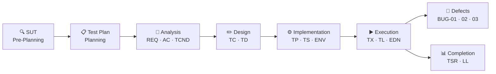
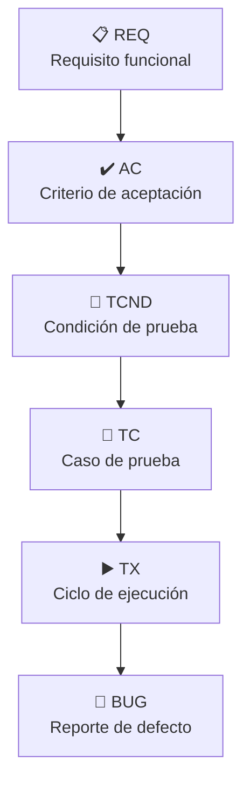

# 🧪 ISTQB Manual QA — E-commerce Functional Testing

**Luis Malave · QA Tester in Progress**

&nbsp;

---
> 🌐 **Idioma:** Estás leyendo la versión en español.
> [🇬🇧 English version available here](../../tree/main)

---

## ¿Qué es esto?

Apliqué el ciclo completo del STLC sobre un sistema e-commerce demo — el tipo de entorno que un QA tiene disponible para practicar sin depender de accesos corporativos. Todo documentado en Markdown para que sea trazable, navegable y reproducible. Los defectos están registrados también en Jira como práctica de flujo en tracker.

Me apoyé en IA en dos frentes: usé ingeniería inversa para construir el contexto de los requisitos, y usé un prompt por fase para estructurar cada artefacto. También la usé como herramienta de investigación para profundizar en las guías ISTQB mientras construía. En todos los casos apliqué lo que establece el CT-GenAI v1.1: el modelo propone, el tester analiza, audita y decide — la evaluación humana sistemática del output es condición para que el uso de IA sea válido.

> [!NOTE]
> Este repositorio tiene fases que van más allá de lo que se le pide
> a un QA junior en el día a día. No fue un error, fue una decisión.
> Cuando entendés cómo se construye un Test Plan o cómo se cierra un
> ciclo con un Summary Report, las tareas que sí te van a pedir
> empiezan a tener otro sentido.

> [!TIP]
> Si estás armando tu primer portafolio QA, este repositorio puede
> servirte de laboratorio. La carpeta [`08-genai-test-acceleration`](./08-genai-test-acceleration/README.md)
> tiene los 19 prompts usados para construir cada artefacto —
> documentados y listos para ejecutarlos en tu propio proyecto.

---

## ¿Qué se probó y cómo?

| Atributo | Detalle |
| :--- | :--- |
| **SUT** | Tricentis Demo Web Shop — E-commerce B2C |
| **Nivel** | System Testing |
| **Tipo** | Functional Testing — Caja Negra |
| **Estrategia** | Risk-Based Testing |
| **Técnicas** | EP · BVA · State Transition · Error Guessing |
| **Entorno** | Windows 10 Pro / Firefox 150.0.1 |
| **Módulos** | Búsqueda · Catálogo · Producto · Carrito · Registro · Login · Checkout |

> [!NOTE]
> Este repositorio es exclusivamente de pruebas funcionales manuales.
> API testing, automatización y SQL no están acá porque los estoy
> aprendiendo en paralelo — cada uno tendrá su propio repositorio
> cuando esté listo para documentarlo con el mismo nivel de criterio
> que este. Los links van a aparecer en mi perfil de GitHub.

---

## Flujo del ciclo

## Métricas del ciclo

| Indicador | Resultado |
| :--- | :--- |
| ✅ Ciclos de ejecución (`TX`) | 12 / 12 completados |
| ✅ Pass Rate E2E (`TS-03`) | 100% |
| ✅ Defectos Critical / High al cierre | 0 |
| ✅ Cobertura de requisitos | 7 / 7 `REQ` con al menos 1 `TX` PASS |
| 🔴 Defectos abiertos | 3 (**`BUG-01`** Medium · **`BUG-02`** Low · **`BUG-03`** Medium) |
| 📄 Artefactos producidos | 19 documentos Markdown |
| 📅 Período del proyecto | Feb 2026 — May 2026 |
| 🤖 Prompts AI-Gen documentados | 19 prompts reproducibles |

---

## El módulo AI-Gen

> [!IMPORTANT]
> La carpeta `08-genai-test-acceleration` no es un extra. Es la  
> documentación de cómo se usó la IA en cada fase del ciclo, alineada  
> al estándar **CT-GenAI v1.1** de ISTQB. Cada prompt tiene descripción  
> del artefacto, instrucción, input data, constraints y output format —  
> listos para ejecutarse en cualquier proyecto nuevo.

---

## Navegar el proyecto

| # | Módulo | Contenido | Estado |
| :--- | :--- | :--- | :--- |
| `00` | [Context & Overview](./00-context-and-overview/) | SUT — Sistema bajo prueba | ✅ Approved |
| `01` | [Test Planning](./01-test-planning/) | Test Plan · Alcance · Riesgos · Criterios | ✅ Approved |
| `02` | [Test Analysis](./02-test-analysis/) | REQ · AC · Anomalías · Condiciones de prueba | ✅ Approved |
| `03` | [Test Design](./03-test-design/) | Test Cases · Test Data | ✅ Approved |
| `04` | [Test Implementation](./04-test-implementation/) | Procedimientos · Suites · Entorno | ✅ Approved |
| `05` | [Test Execution](./05-test-execution/) | TX · Logs · EDN · Execution Summary | ✅ Completado |
| `06` | [Defect Management](./06-defect-management/) | **`BUG-01`** · **`BUG-02`** · **`BUG-03`** · [Jira Evidence](./05-test-execution/test-evidence/jira-evidence/) | 🔴 Open |
| `07` | [Test Completion](./07-test-completion/) | Test Summary Report · Lessons Learned | ✅ Completado |
| `08` | [GenAI Test Acceleration](./08-genai-test-acceleration/) | 19 prompts reproducibles — CT-GenAI v1.1 | ✅ Documentado |

---

## Trazabilidad de un vistazo

> [!IMPORTANT]
> Cada artefacto referencia al de la fase anterior. No existe ningún
> documento huérfano — **Zero Orphans** es una regla activa en todo
> el ciclo.

---

## Stack

- Markdown
- VSCode
- GitHub
- ShareX
- Jira

---

*Luis Malave · QA Tester in Progress · Feb — May 2026*